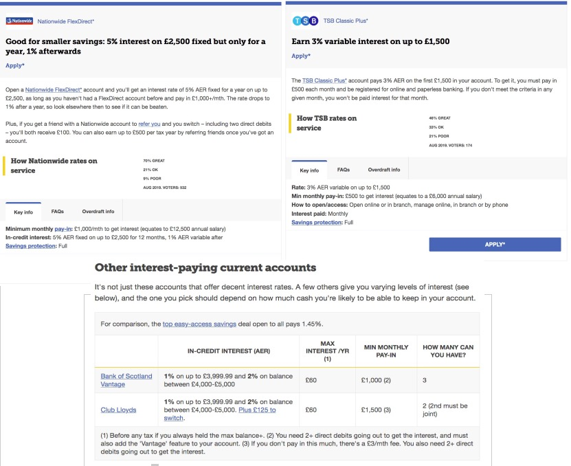
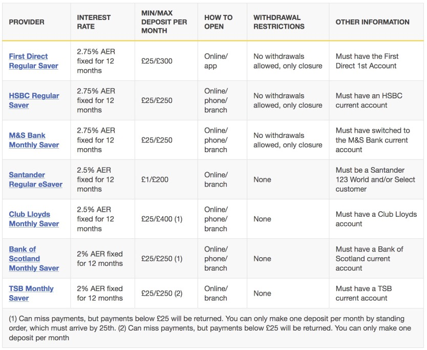

### 3. WHERE TO PUT YOUR SAVINGS

We now have a stream of money that we don't spend every month. Great! The first part of our plan is now complete. Now we want this stream of money to generate more money, so we can increase the stream month after month.

It's usually a good idea to have a month worth of expenses. Other authors say three. I personally think one can be short at times, and three may be too much to keep always available. This is not exact maths, so find a solution according to your needs. If you don't have a clue you can start with a month. So, our first financial goal will be to save up the amount of money we need to continue living the same way for a month, multiplied by the number of months we have chosen.

And here is when it becomes interesting. While you get there, you may as well get some interest on your savings. There are several ways to do this but under no circumstance have your savings at 0%. Why would you? Nowadays there are current bank accounts that pay you interest on your balance.

> Current bank accounts with interest. Source: [moneysavingexpert.com](moneysavingexpert.com)

Alternatively, you could choose a savings account or even a cash ISA.

> Regular savings accounts. Source: [moneysavingexpert.com](moneysavingexpert.com)

The important thing about your rainy day fund is that it is liquid, or immediately available to spend. If you have your rainy day fund invested in something less liquid such as gold, you will need to sell that gold first in case of financial adversities, and a buyer may not be readily available.

A very important rule to remember is, once each penny reaches your savings, it won't leave them. This means once you put a penny into for example a savings account, even when the account matures and gets closed that doesn't become expendable cash. It comes from your savings and they shall be repurposed to start generating their own money in the product of our choice. Your savings always grow (or stay the same) but never decrease. You can be more lenient about this rule once you have many streams of income, and can intelligently repurpose some of them to fit your needs.

Once you have the bare minimum, that is you rainy day fund full, then you can think about taking more risky steps.
